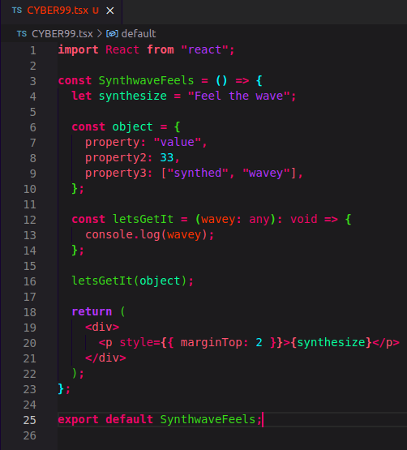

# CYBER99, Cyberpunk Theme for [Visual Studio Code](http://code.visualstudio.com)

## This cyberpunk theme is hella gnarly ! It's much bodacious !

## Screenshot

## Install

1. Go to Extensions.
2. Search for CYBER99
3. Press: Install
4. Press: Set Color Theme
5. Click CYBER99 in the top of your screen in the dropdown.

### Tip

6.  For the best experience got to you settings.json file, and add these two lines:

        "editor.bracketPairColorization.enabled": true,
        "window.titleBarStyle": "custom"

7.  Restart VSCode just to be sure :)
8.  Enjoy!

## Love it or hate it?

Love it? Keep it! Hate it? Delete it!

If you do love it, feel free to leave a review! [Leave a Review](https://marketplace.visualstudio.com/items?itemName=LetsWebDevelop.cyber99&ssr=false#review-details)

## Contributing

If you want to contribute to this theme, read the [Contributing Guidelines](https://github.com/LetsWebDevelop/Cyber99/tree/master/.github)

## License

[MIT License](https://github.com/LetsWebDevelop/Cyber99/blob/master/LICENSE.txt)
